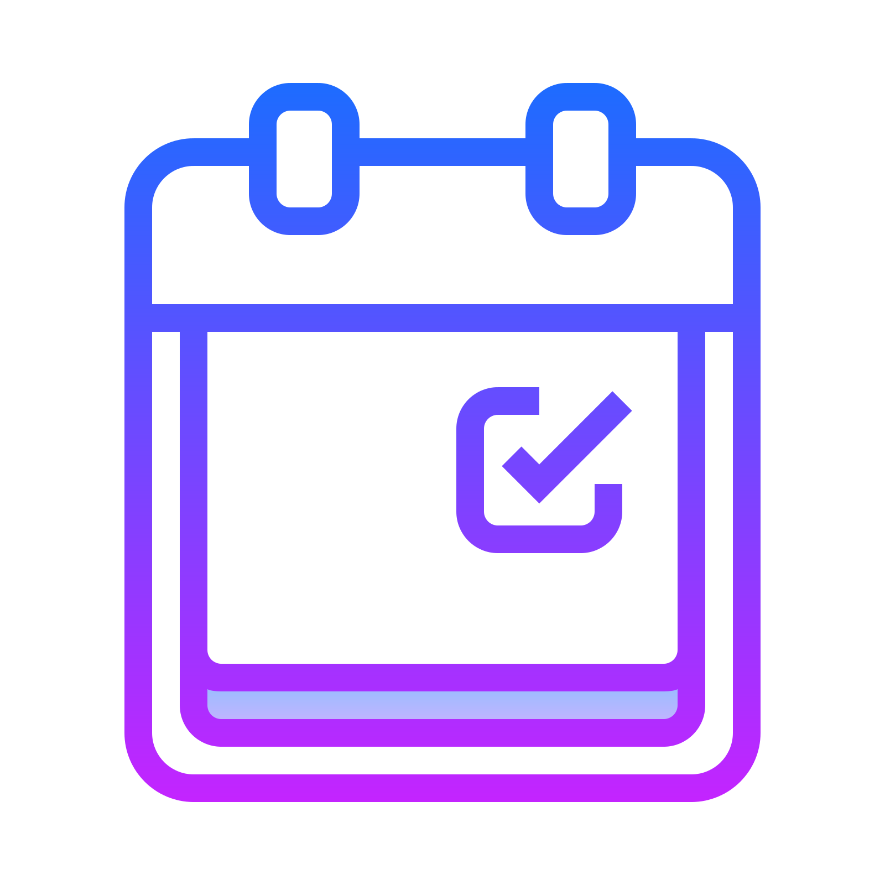

<p align="center">

<br>
<h1 align="center">
  Agenda API
</h1>

</p>
<p align="center">
  A project built with Node.js, Express, Prisma, and SQLite.
</p>

<p align="center">


    

</p>


## 📝 About

This API was built with the intention of being used like an agenda. You can create notes, reminders, checklists, and add contacts. Fun fact: the reminders are sent to your email. In this project, I tried to use the best practices of Node.js. I also tried to use the SOLID principles and some DDD (Domain-Driven Design) patterns.

<br>

## 🎲 Database Diagram


## ⚙️ Pre-requisites
- Node.js (16.15.0 or higher)
- NPM (8.19.2 or higher)

## 🏃‍♂️ Run
>Make sure you create your .env file using .env.example as a template

Install Dependencies
```
npm install
```
Run Migrations
```
npx prisma migrate dev 
```
Start Development Server
```
npm run dev
``` 
Generate Build
```
npm run build
```
